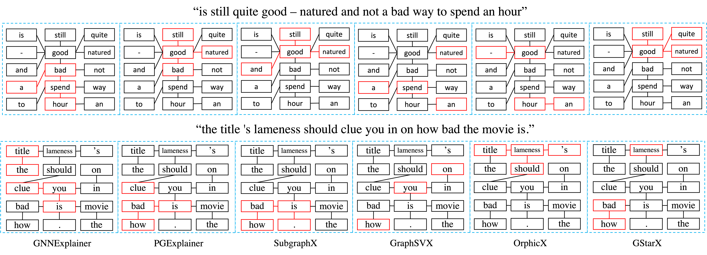
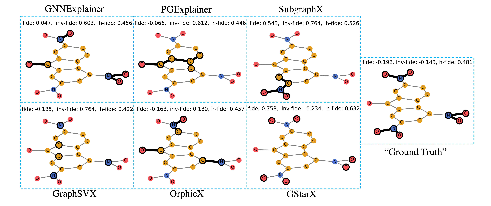

<!-- #region -->
# <ins>G</ins>raph <ins>St</ins>ructure-<ins>a</ins>wa<ins>r</ins>e E<ins>x</ins>planation (GStarX)

Code for [Explaining Graph Neural Networks with Structure-Aware Cooperative Games](https://arxiv.org/abs/2201.12380) by [Shichang Zhang](https://shichangzh.github.io/), [Yozen Liu](https://research.snap.com/team/yozen-liu/), [Neil Shah](http://nshah.net/), and [Yizhou Sun](http://web.cs.ucla.edu/~yzsun/).


## Visualizations

### Explanation on the `graph-sst2` dataset

GStarX concisely captures the important words for sentiment classification without including extraneous ones for either the positive sentence or the negative sentence.

<p align="center">
  <br />
  
  <br />
</p>

### Explanation on the `mutag` dataset

GStarX generates explanations with much better Fidelity/Inv-Fidelity/H-Fidelity than other methods and even better than the “ground truth” specified by the domain knowledge.

<p align="center">
  <br />
  
  <br />
</p>


## Getting Started

### Requirements
- Please follow the links below to install PyTorch and PyG with proper CUDA versions
    - PyTorch https://pytorch.org/
    - PyG https://github.com/pyg-team/pytorch_geometric

- Then install packages by running the line below
```bash
pip install -r requirements.txt
```

- Our code has been tested with
    - Python = 3.8.10
    - PyTorch = 1.10.0
    - PyG = 1.7.2


### Datasets
To run experiments for datasets used in the paper, please download them from this [link](https://github.com/divelab/DIG/tree/main/dig/xgraph/datasets) and put them under `datasets/` (all dataset folder names should be in **lowercase**, some of them need to be renamed. Please be consistent with `dataset.py`). 

You may also add your favourite datasets by modifying the `get_dataset` function in `dataset.py`.

### Models
We borrow the `GCN`, `GIN`, and `GAT` implementation and the model training script `train_gnns.py` from the DIG library. Pre-trained checkpoints of these models are stored in `checkpoints/`


### Usage
- Run the GStarX to explain trained GNN models 
  - A simple example is shown below, and more examples are in `script.sh`
```bash
python run_gstarx.py models='gcn' datasets='mutag'
```

- Run a baslineline method to explain trained GNN models
   - Run baseline scripts like the example below by replacing `method` with `gnn_explainer`, `pgexplainer`, `subgraphx`, `graphsvx`, or `orphicx`.
```bash
python baselines/run_${method}.py models='gcn' datasets='bace'
```

- Train new GNNs to explain
  - If not GCN, GIN, or GAT, add the model architecture to `getNets.py`, and add its configuration to `config`
  - Run `train_gnns.py` as the example below
```bash
python train_gnns.py datasets=ba_2motifs models=gat
```

## Results

GStarX vs. other methods for graph prediction explanation in terms of the H-Fidelity metric. GStarX outperforms others on most datasets, on average, and on different GNN architectures. (Please see Table 1 and Table 2 in the paper).


| Datasets        | GNNExplainer | PGExplainer  | SubgraphX    | GraphSVX     | OrphicX      | GStarX       |
|-----------------|--------------|--------------|--------------|--------------|--------------|--------------|
| BA_2Motifs (GCN)| 0.4841       | 0.4879       | **0.6050**   | 0.5017       | 0.5087       | 0.5824       |
| BACE (GCN)      | 0.5016       | 0.5127       | 0.5519       | 0.5067       | 0.4960       | **0.5934**   |
| BBBP (GCN)      | 0.4735       | 0.4750       | **0.5610**   | 0.5345       | 0.4893       | 0.5227       |
| GraphSST2 (GCN) | 0.4845       | 0.5196       | 0.5487       | 0.5053       | 0.4924       | **0.5519**   | 
| MUTAG (GCN)     | 0.4745       | 0.4714       | 0.5253       | 0.5211       | 0.4925       | **0.6171**   |
| Twitter (GCN)   | 0.4838       | 0.4938       | 0.5494       | 0.4989       | 0.4944       | **0.5716**   |
| Average (GCN)   | 0.4837       | 0.4934       | 0.5569       | 0.5114       | 0.4952       | **0.5732**   |

| Datasets        | GNNExplainer | PGExplainer  | SubgraphX    | GraphSVX     | OrphicX      | GStarX       |
|-----------------|--------------|--------------|--------------|--------------|--------------|--------------|
| GraphSST2 (GAT) | 0.4951       | 0.4918       | 0.5484       | 0.5132       | 0.4997       | **0.5542**   |
| MUTAG (GIN)     | 0.5042       | 0.4993       | 0.5264       | 0.5592       | 0.5152       | **0.6064**   |

## Cite

Please cite our paper if you find this code is useful. Thank you.
```
@misc{zhang2022explaining,
      title={Explaining Graph-level Predictions with Communication Structure-Aware Cooperative Games}, 
      author={Shichang Zhang and Neil Shah and Yozen Liu and Yizhou Sun},
      year={2022},
      eprint={2201.12380},
      archivePrefix={arXiv},
      primaryClass={cs.LG}
}
```

## Reference
Our code heavily relies on the DIG library. We encourage readers to check it out:

https://github.com/divelab/DIG/tree/dig/benchmarks/xgraph

## Contact Us

Please open an issue or contact shichang@cs.ucla.edu if you have any questions.


<!-- #endregion -->
